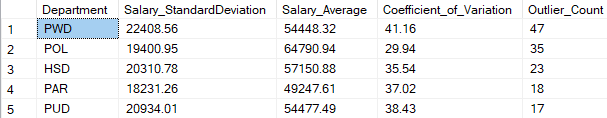
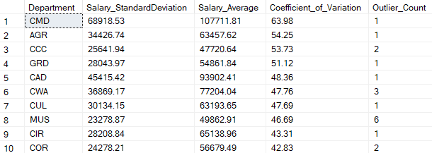

# SQL Department Analysis
## Objective
**Addressing Salary Disparities**: Managers need insights into salary variations within departments to identify and address discrepancies. This project aims to:

- Investigate the factors contributing to salary variances within each department.
- Develop actionable insights to reduce discrepancies and promote fair compensation practices.
## Insight

*By Outlier Count* 

*By Coeffecient of Variation* 

Based on all these metrics (Coefficient of Variation, outliers, standard deciation), These departments show the most variance and discrepancy in salary according to the metrics:

1. **CMD**: High CV, high standard deviation, and some outliers.
2. **AGR**: High CV, fairly high standard deviation, and some outliers.
3. **CCC**: High CV, fair number of outliers.
4. **PWD**: High number of outliers and fair CV.
5. **CWA**: fairly high standard deviation, high CV and fair number of outliers.

## Project Workflow

1. Data Preparation:

    - Filtered the salary data to exclude values below $10,000 to focus on meaningful analysis.
    - Grouped data by department and calculated metrics: Standard Deviation, Average Salary, and Coefficient of Variation (CV).
2. Outlier Detection:

    - Used z-scores to identify significant outliers beyond ±1.96 standard deviations.
    - Counted the number of outliers per department.

3. Key Metrics:

    - Standard Deviation: Measures salary dispersion within a department.
     -Coefficient of Variation (CV): Highlights salary variability relative to the mean salary.
    - Outlier Count: Quantifies extreme salary discrepancies.

4. SQL Query Implementation:

    - CTEs (Common Table Expressions) were used to structure the query:
        - `Department_Stats`: Computes departmental salary statistics.
        - `Department_ZScores`: Calculates z-scores for individual salaries.
    - Aggregated results to summarize key metrics for each department.

5. Result Analysis:

    - Departments were ranked based on outlier count and CV to identify those with the most significant salary disparities.
